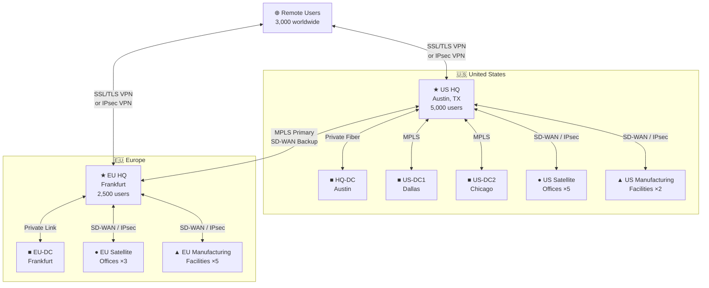
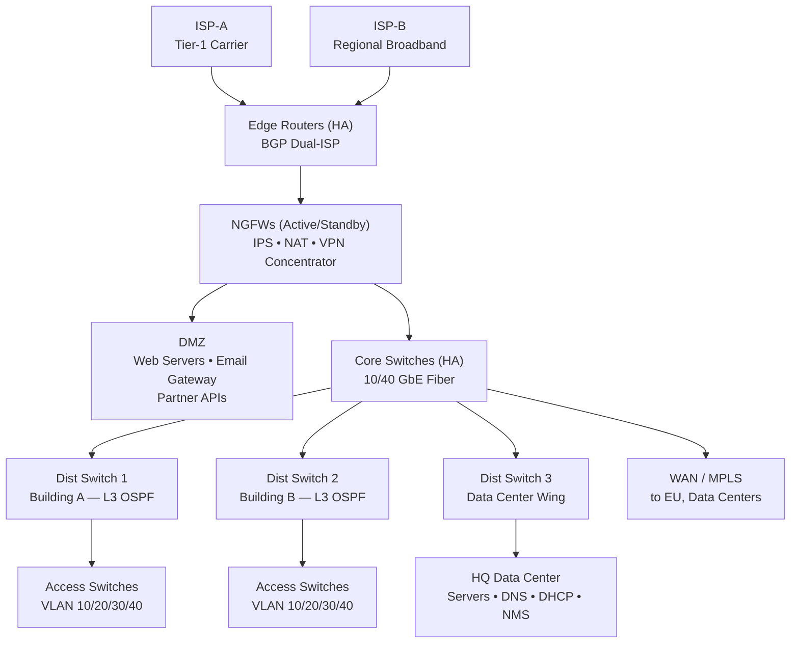
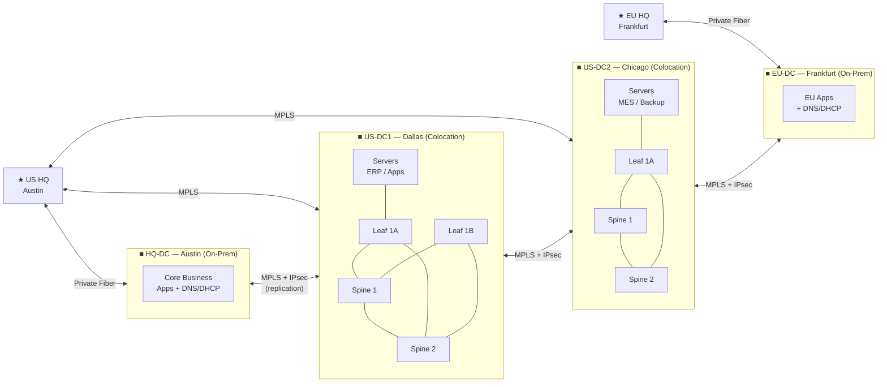
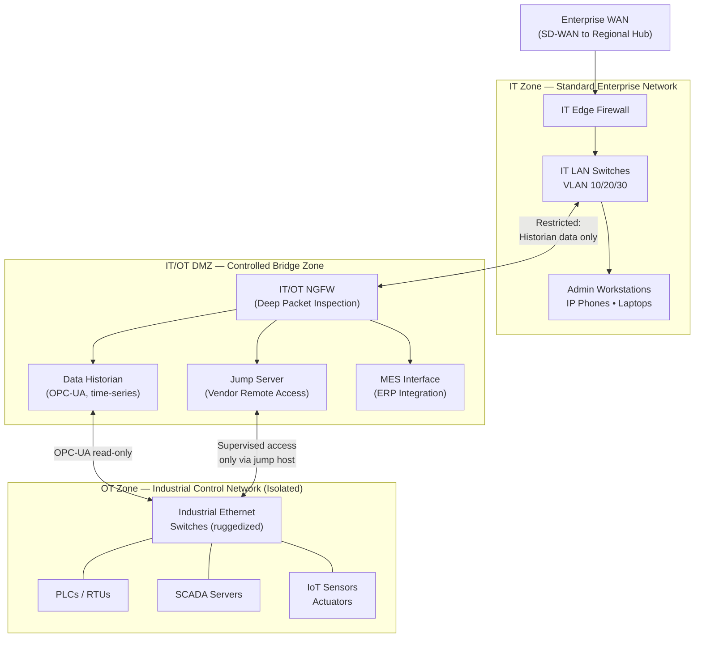
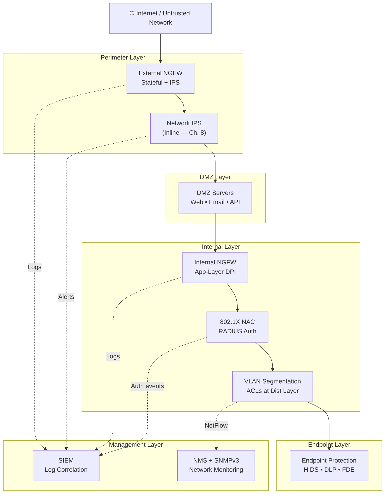
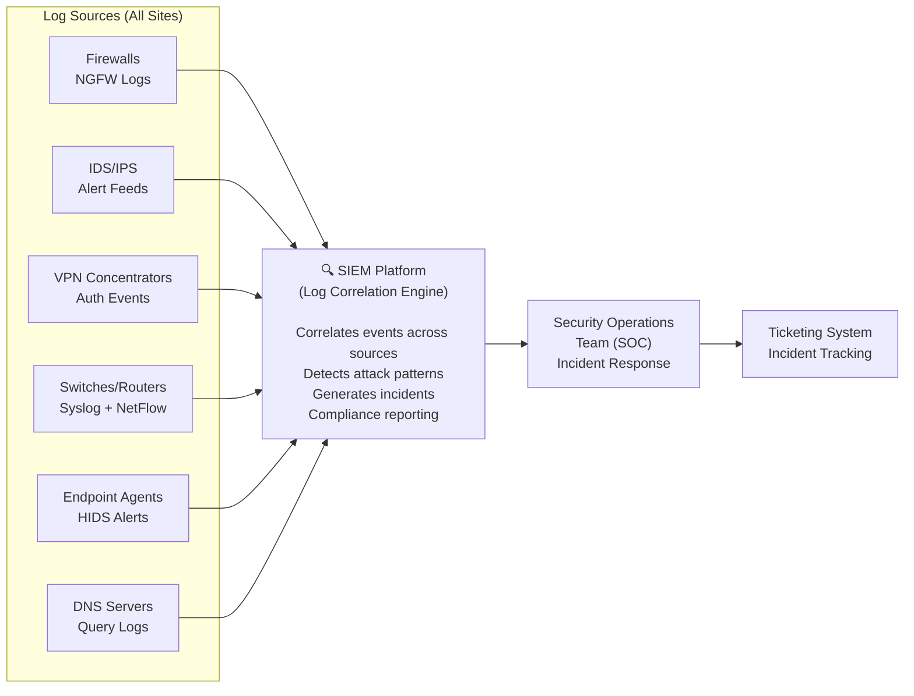

# DIAGRAMS.md — Barrios Manufacturing & Solutions Network Architecture
## All Network Diagrams for Term Paper

> Each diagram below corresponds to a `Figure` reference in the paper sections.  
> Mermaid diagrams can be rendered in VS Code, GitHub, Obsidian, or any Mermaid-compatible viewer.  
> ASCII diagrams can be pasted directly into Word/Google Docs as monospace (Courier New) code blocks.

---

## Figure 1 — Global Site Distribution (Company Overview)

```
┌─────────────────────────────────────────────────────────────────────────┐
│                  BARRIOS MANUFACTURING & SOLUTIONS, INC.                │
│                        Global Network Footprint                         │
├─────────────────────────────────┬───────────────────────────────────────┤
│        UNITED STATES            │              EUROPE                   │
│                                 │                                       │
│  ★ HQ — Austin, TX (5,000)     │  ★ EU HQ — Frankfurt (2,500)         │
│                                 │                                       │
│  ● Satellite Office ×5          │  ● Satellite Office ×3               │
│    (50–250 users each)          │    (50–250 users each)               │
│                                 │                                       │
│  ▲ Manufacturing ×2             │  ▲ Manufacturing ×5                  │
│                                 │                                       │
│  ■ Data Center HQ (Austin)      │  ■ Data Center EU (Frankfurt)        │
│  ■ Data Center US-DC1 (Dallas)  │                                       │
│  ■ Data Center US-DC2 (Chicago) │                                       │
│                                 │                                       │
│  ⊕ Remote Users (worldwide): 3,000 sales reps & remote employees       │
└─────────────────────────────────┴───────────────────────────────────────┘
```

---

## Figure 2 — Site Inventory Table (Company Overview)

| Site Type | Region | Count | Users / Notes |
|-----------|--------|-------|--------------|
| Headquarters | US (Austin, TX) | 1 | 5,000 users |
| Main Regional Office | Europe (Frankfurt) | 1 | 2,500 users |
| Satellite Offices | US | 5 | 50–250 users each |
| Satellite Offices | Europe | 3 | 50–250 users each |
| Manufacturing Facilities | US | 2 | IT + OT environments |
| Manufacturing Facilities | Europe | 5 | IT + OT environments |
| Third-Party Data Centers | US (Dallas, Chicago) | 2 | Colocation hosted |
| HQ Data Center | US (Austin) | 1 | On-premises at HQ |
| EU Data Center | Europe (Frankfurt) | 1 | On-premises at EU HQ |
| Remote Users (VPN) | Worldwide | — | ~3,000 concurrent |

---

## Figure 3 — Hierarchical Network Design (Network Architecture Overview)

```
                    THREE-TIER CAMPUS HIERARCHY
                    (Kurose & Ross, Ch. 1, Ch. 6)

    ┌──────────────────────────────────────────────────────────┐
    │                    CORE LAYER                            │
    │         High-speed backbone (fiber, redundant)           │
    │    [Core Switch A] ════════════ [Core Switch B]          │
    │         (10/40 Gbps fiber interconnects)                 │
    └──────────────────────────┬───────────────────────────────┘
                               │
    ┌──────────────────────────▼───────────────────────────────┐
    │               DISTRIBUTION LAYER                         │
    │    Inter-VLAN routing • Policy enforcement • OSPF        │
    │  [Dist Switch 1]  [Dist Switch 2]  [Dist Switch 3]       │
    │       (Layer 3 switches — one per building/zone)         │
    └──────────────────────────┬───────────────────────────────┘
                               │
    ┌──────────────────────────▼───────────────────────────────┐
    │                   ACCESS LAYER                           │
    │           End-user device connectivity (PoE)             │
    │  [Acc Sw] [Acc Sw] [Acc Sw] [Acc Sw] [Acc Sw] [Acc Sw]  │
    │     │        │        │        │        │        │       │
    │  PCs/VoIP  PCs/VoIP  APs    PCs/VoIP  IoT   PCs/VoIP   │
    └──────────────────────────────────────────────────────────┘
```

---

## Figure WAN-1 — Enterprise Global WAN Topology



---

## Figure WAN-2 — MPLS Hub-and-Spoke with SD-WAN Overlay

```
                    ╔══════════════════════════════════════╗
                    ║         CARRIER MPLS CLOUD           ║
                    ║   (Label Switched Paths — Ch. 4, 5)  ║
                    ╚══════════╤═══════════╤═══════════════╝
                               │           │
               ┌───────────────┘           └─────────────────────┐
               │                                                  │
    ┌──────────▼──────────┐                         ┌────────────▼───────────┐
    │    US HQ (Hub)      │                         │   EU HQ (Regional Hub) │
    │  Austin, TX         │ ◄─── Transatlantic ───► │   Frankfurt            │
    │  BGP Dual-ISP       │      MPLS Circuit        │   BGP Dual-ISP         │
    └──────────┬──────────┘                         └────────────┬───────────┘
               │  SD-WAN IPsec Tunnels (Spokes)                  │
         ┌─────┴─────┬──────────┬──────────┐           ┌─────────┴──────┬────────┐
         │           │          │          │           │                │        │
    [SAT-US1]  [SAT-US2]  [SAT-US3]  [MFG-US1]  [SAT-EU1]      [SAT-EU2]  [MFG-EU1]
    SD-WAN     SD-WAN     SD-WAN     SD-WAN      SD-WAN          SD-WAN     SD-WAN
    Appliance  Appliance  Appliance  Appliance   Appliance       Appliance  Appliance
```

---

## Figure WAN-3 — BGP Dual-ISP at HQ Edge

```
                    ┌───────────┐         ┌───────────┐
                    │   ISP-A   │         │   ISP-B   │
                    │  (Tier 1) │         │ (Regional)│
                    └─────┬─────┘         └─────┬─────┘
                          │ BGP eBGP             │ BGP eBGP
                    ┌─────▼─────────────────────▼─────┐
                    │        EDGE ROUTERS (HA pair)    │
                    │   eBGP to both ISPs              │
                    │   AS Path, Local-Pref tuning     │
                    └──────────────┬──────────────────┘
                                   │
                    ┌──────────────▼──────────────────┐
                    │     NEXT-GEN FIREWALLS (HA)     │
                    │   Stateful inspection • IPS     │
                    └──────────────┬──────────────────┘
                                   │
                    ┌──────────────▼──────────────────┐
                    │          CORE SWITCHES          │
                    │       US HQ Internal LAN        │
                    └─────────────────────────────────┘
```

---

## Figure HQ-1 — US Headquarters Three-Tier Network with Edge



---

## Figure EU-1 — European Office Three-Tier Network Diagram

```
         ┌──────────────────────────────────────────────────────┐
         │              EUROPEAN MAIN OFFICE — FRANKFURT        │
         │                                                      │
         │  [ISP-DE1: Deutsche Telekom]  [ISP-EU2: Broadband]  │
         │         │ BGP                       │ BGP            │
         │  ┌──────▼────────────────────────▼──────┐          │
         │  │        EDGE ROUTERS (HA) + NGFW       │          │
         │  │     NAT • IPS • VPN Concentrator      │          │
         │  └─────────────────────┬─────────────────┘          │
         │                        │                             │
         │  ┌─────────────────────▼─────────────────┐          │
         │  │         CORE SWITCHES (10 GbE HA)      │          │
         │  └──────┬────────────┬──────────┬────────┘          │
         │         │            │           │                   │
         │  [Dist-EU1]    [Dist-EU2]   [Dist-EU3]              │
         │  Floor 1-3     Floor 4-6    DC Wing                  │
         │      │              │            │                   │
         │  [Access Sw]   [Access Sw]   [EU-DC Servers]        │
         │  VLAN 10/20/30  VLAN 10/20    DNS/DHCP              │
         │                                                      │
         └──────────────────────────────────────────────────────┘
```

---

## Figure DC-1 — Enterprise Data Center Topology and WAN Connectivity



---

## Figure DC-2 — Data Center Leaf-Spine Architecture

```
        ┌─────────────┐          ┌─────────────┐
        │   Spine 1   │◄────────►│   Spine 2   │
        │  (100 GbE)  │          │  (100 GbE)  │
        └──┬──────┬───┘          └───┬──────┬──┘
           │      │                  │      │
      ┌────▼─┐  ┌─▼────┐       ┌────▼─┐  ┌─▼────┐
      │Leaf A│  │Leaf B│       │Leaf C│  │Leaf D│
      │25GbE │  │25GbE │       │25GbE │  │25GbE │
      └──┬───┘  └──┬───┘       └──┬───┘  └──┬───┘
         │         │              │          │
    [Servers]  [Servers]     [Servers]   [Storage]
    App Tier   DB Tier       Backup      SAN/NAS

    Any server → any server = exactly 2 hops
    (Leaf → Spine → Leaf)
    Ch. 4: Consistent forwarding path, no bottleneck
```

---

## Figure DC-3 — DMZ Dual-Firewall Architecture

```
    ═══════════════════ INTERNET ═══════════════════
                             │
                    ┌────────▼────────┐
                    │  External NGFW  │
                    │  Stateful filter│
                    │  IPS (inbound)  │
                    └────────┬────────┘
                             │
    ╔══════════════════════════════════════╗
    ║              D M Z                   ║
    ║  ┌──────────┐  ┌────────────────┐   ║
    ║  │ Web/App  │  │ Email Gateway  │   ║
    ║  │ Servers  │  │ Partner APIs   │   ║
    ║  └──────────┘  └────────────────┘   ║
    ╚══════════════════════════════════════╝
                             │
                    ┌────────▼────────┐
                    │  Internal NGFW  │
                    │  App-layer DPI  │
                    │  ACL enforcement│
                    └────────┬────────┘
                             │
    ╔══════════════════════════════════════╗
    ║         INTERNAL SERVER FARM         ║
    ║  Databases • ERP Backend • LDAP      ║
    ╚══════════════════════════════════════╝

    (Kurose & Ross Ch. 8: Defense-in-depth,
     attacker must breach TWO firewalls to
     reach internal servers)
```

---

## Figure SAT-1 — Satellite Office Collapsed Two-Tier Architecture

```
    ┌────────────────────────────────────────────────────────┐
    │            SATELLITE OFFICE (50–250 users)             │
    │                                                        │
    │  [Broadband ISP 1]    [Broadband ISP 2 / 4G backup]   │
    │         │                      │                       │
    │  ┌──────▼──────────────────────▼──────┐               │
    │  │   SD-WAN Edge Appliance             │               │
    │  │   IPsec VPN to Regional Hub         │               │
    │  │   Local Internet Breakout           │               │
    │  │   Integrated Firewall               │               │
    │  └─────────────────────────┬──────────┘               │
    │                            │                           │
    │  ┌─────────────────────────▼──────────┐               │
    │  │   Collapsed Core (Layer 3 Switch)   │               │
    │  │   OSPF • Inter-VLAN routing • ACLs  │               │
    │  └────┬──────────────┬────────────┬───┘               │
    │       │              │            │                    │
    │  [Access Sw 1]  [Access Sw 2]  [Access Sw 3]          │
    │   VLAN 10/20     VLAN 10/30    VLAN 40/50              │
    │   Workstations   Wireless APs  Mgmt / Guest            │
    └────────────────────────────────────────────────────────┘
```

---

## Figure MFG-1 — Manufacturing Site IT/OT Network Segmentation



---

## Figure VPN-1 — Remote Access VPN Architecture

```
   ┌─────────────────────────────────────────────────────────┐
   │                   REMOTE USERS (3,000)                   │
   │                                                         │
   │  [Home WiFi]  [Hotel Network]  [4G/5G Mobile]  [BYOD]  │
   └──────────────────────────┬──────────────────────────────┘
                               │ TLS 1.3 or IPsec Tunnel Mode
                               │ (Encrypted — Ch. 8)
           ┌────────────────────┴────────────────────┐
           │                                         │
    ┌──────▼──────────┐                    ┌─────────▼───────┐
    │  US VPN         │                    │  EU VPN         │
    │  Concentrators  │                    │  Concentrators  │
    │  US-VPN-1 + 2   │                    │  EU-VPN-1 + 2   │
    │  Active-Active  │                    │  Active-Active  │
    └──────┬──────────┘                    └─────────┬───────┘
           │ MFA: user+password + TOTP              │
           │ Device cert (managed devices)          │
           │                                        │
    ┌──────▼──────────────────────────────▼─────────┐
    │              ENTERPRISE NETWORK                │
    │     US HQ ←→ EU HQ ←→ Data Centers            │
    │     All internal application resources         │
    └────────────────────────────────────────────────┘

   SPLIT TUNNEL POLICY:
   ├── *.barrios.internal → VPN tunnel → internal DNS → app server
   ├── SaaS (M365, Salesforce) → local Internet breakout (direct)
   └── Sensitive systems (finance, MES) → full tunnel enforced
```

---

## Figure VPN-2 — IPsec Tunnel Mode Encapsulation

```
   ORIGINAL PACKET (before IPsec):
   ┌──────────────┬───────────────┬────────────────────────────────┐
   │ Original IP  │  TCP/UDP Hdr  │          Payload (data)        │
   │ Header       │               │                                │
   └──────────────┴───────────────┴────────────────────────────────┘

   AFTER IPsec TUNNEL MODE (ESP) ENCAPSULATION (Ch. 8):
   ┌─────────────┬─────┬══════════════════════════════════════════╗
   │ New IP Hdr  │ ESP │  ENCRYPTED: [Original IP][TCP/UDP][Data] ║
   │ (public IPs)│ Hdr │  + ESP Authentication Trailer            ║
   └─────────────┴─────┴══════════════════════════════════════════╝

   • New outer IP header: src = VPN appliance public IP,
                          dst = VPN concentrator public IP
   • Original IP packet: fully encrypted by AES-256-GCM
   • ESP Authentication: HMAC-SHA-256 integrity check
   • Eavesdropper sees only: encrypted blob between two public IPs
```

---

## Figure SEC-1 — Defense-in-Depth Security Architecture



---

## Figure SEC-3 — 802.1X NAC Authentication Flow

```
  End-User Device          Access Switch          RADIUS Server
  (Supplicant)             (Authenticator)        (Auth Server)
       │                        │                      │
       │── EAPOL Start ────────►│                      │
       │                        │── RADIUS Access ────►│
       │                        │   Request (EAP)      │
       │◄── EAP Request ────────│◄─ RADIUS Challenge ──│
       │    (Identity)          │                      │
       │── EAP Response ───────►│── RADIUS Access ────►│
       │   (username/cert)      │   Request w/creds    │
       │                        │                      │
       │                        │◄─ RADIUS Access ─────│
       │                        │   Accept/Reject      │
       │◄── EAP Success ────────│                      │
       │    (port opened)       │                      │
       │                        │
       │    Port placed in appropriate VLAN (VLAN 10, 30, 50...)
       │    or quarantine VLAN if authentication fails
```

---

## Figure WIFI-1 — Wireless Controller Architecture (WLC + LWAP)

```
                    ┌──────────────────────────────┐
                    │   WIRELESS LAN CONTROLLER     │
                    │   (WLC — Centralized)         │
                    │   SDN-style: Policy + Control │
                    │   Ch. 4: Separation of planes │
                    └──────────────┬───────────────┘
                                   │ CAPWAP Tunnels
              ┌────────────────────┼────────────────────┐
              │                    │                    │
    ┌─────────▼────┐    ┌──────────▼─────┐   ┌────────▼───────┐
    │  LWAP-1      │    │   LWAP-2       │   │   LWAP-3       │
    │  Floor 1     │    │   Floor 2      │   │  Conf. Room    │
    │  802.11ax    │    │   802.11ax     │   │  Wi-Fi 6E      │
    │  2.4+5 GHz   │    │   2.4+5 GHz   │   │  2.4+5+6 GHz   │
    └──────┬───────┘    └──────┬─────────┘   └───────┬────────┘
           │                   │                     │
    ┌──────▼────────────────────▼─────────────────────▼────────┐
    │                  WIRED LAN BACKBONE                       │
    │              (PoE Access Switches — Ch. 6)                │
    └───────────────────────────────────────────────────────────┘
```

---

## Figure WIFI-3 — 802.11 CSMA/CA Medium Access (Textbook Concept)

```
   CSMA/CA: Carrier Sense Multiple Access with Collision Avoidance
   (Kurose & Ross, Ch. 7)

   Device A           Channel              Device B
      │                                       │
      │── Sense channel (idle?) ──────────────│
      │   [Channel idle > DIFS time]          │
      │── Random Backoff Timer ───────────────│
      │   [Wait random N slots]               │
      │── TRANSMIT FRAME ──────────────────►  │
      │                                       │
      │                         [B senses channel BUSY]
      │                         [B defers, waits]
      │◄── ACK received ──────────────────── │
      │   (success confirmed)                 │
                                              │
                                 [Channel idle again]
                                 [B counts down backoff]
                                 [B transmits]

   RTS/CTS optional extension (solves Hidden Node problem):
   A sends RTS → AP sends CTS → all hear CTS → only A transmits
```

---

## Figure MGMT-1 — SNMP Manager-Agent Architecture

```
                    ╔═══════════════════════════════╗
                    ║    NETWORK MANAGEMENT SYSTEM  ║
                    ║    (NMS — SNMP Manager)        ║
                    ║    HQ Data Center             ║
                    ║                               ║
                    ║  [GET/SET Requests]           ║
                    ║  [TRAP Receiver]              ║
                    ║  [MIB Browser]                ║
                    ║  [Topology Map]               ║
                    ╚═════════════┬═════════════════╝
                                  │ SNMPv3 (authenticated + encrypted)
              ┌───────────────────┼──────────────────────────────┐
              │                   │                              │
    ┌─────────▼────┐   ┌──────────▼──────┐         ┌────────────▼─────┐
    │  SNMP Agent  │   │   SNMP Agent    │         │   SNMP Agent     │
    │  Core Switch │   │  WAN Router     │   ...   │  Remote Site AP  │
    │              │   │                 │         │                  │
    │  MIB:        │   │  MIB:           │         │  MIB:            │
    │  - ifInOctets│   │  - ifUtilization│         │  - dot11Clients  │
    │  - cpuUsage  │   │  - bgpPeerState │         │  - channelUtil   │
    │  - memUsage  │   │  - ospfNbrState │         │  - signalStrength│
    └──────────────┘   └─────────────────┘         └──────────────────┘
    
    GET = NMS polls agent for MIB values (every 5 min)
    TRAP = Agent sends unsolicited alert (interface down, threshold exceeded)
    SNMPv3 = Adds authentication (HMAC-SHA) + privacy (AES) — Ch. 8
```

---

## Figure MGMT-2 — SIEM Log Aggregation Architecture



---

*All diagrams © Barrios Manufacturing & Solutions Term Paper, 2026*  
*Networking concepts grounded in: Kurose & Ross, Computer Networking: A Top-Down Approach, 8th ed.*
